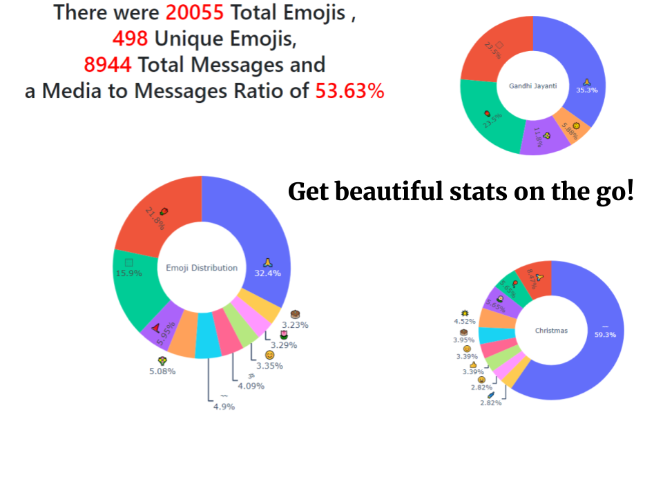
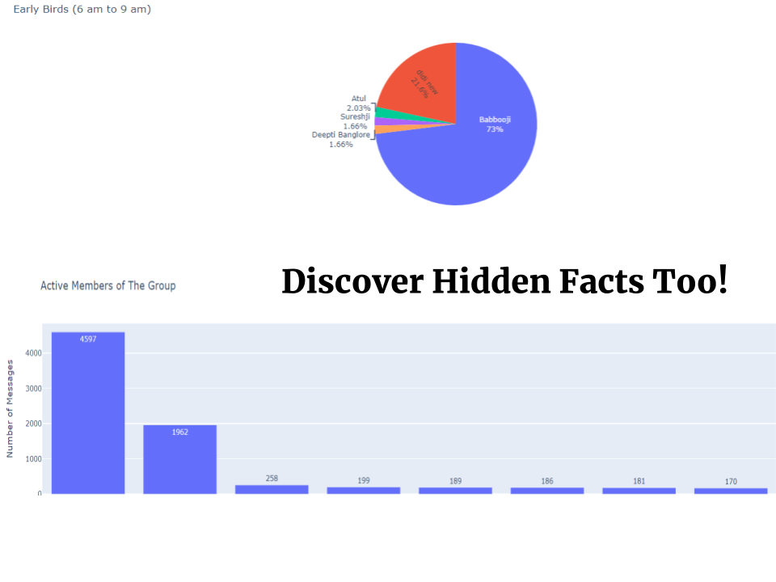

# WhatsApp Groups Analyser 📈📉📊

## About 😁
This Web App gives a detailed report about the WhatsApp Group Chats. It takes the chats text file generated by WhatsApp export (without media), preprocesses the data, **deletes the file uploaded**, and generates the stats report.

## Related Article 📝

[Is Family Group That Bad? Results Will Shock You](https://towardsdatascience.com/is-family-group-that-bad-results-will-shock-you-573f64e194be)

## Tech Stack 🏟
- Python (Language)
- Libraries:
  - Pandas (Data Manipulation)
  - Plotly (Interactive Graphs)
  - HTML (Web inteface)
  - CSS (Web enhancement)
  - Jinja (Templating)
  - Flask (Web app deployment)
- Heroku (Website deployment)

## Gallery 🖼

